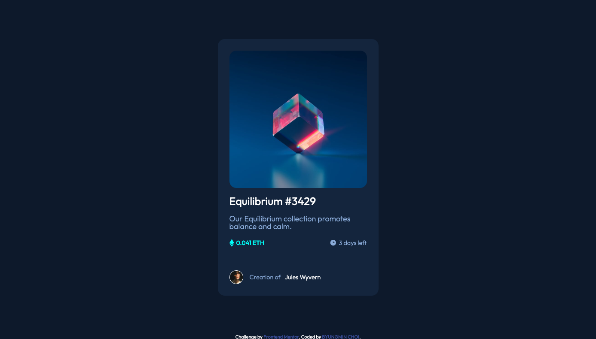
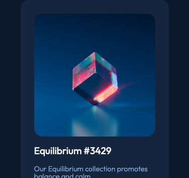
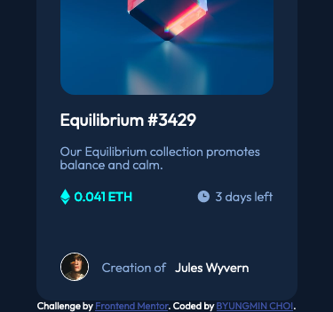
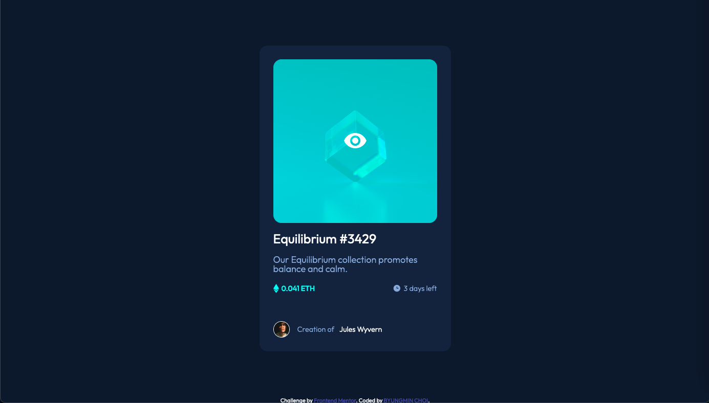
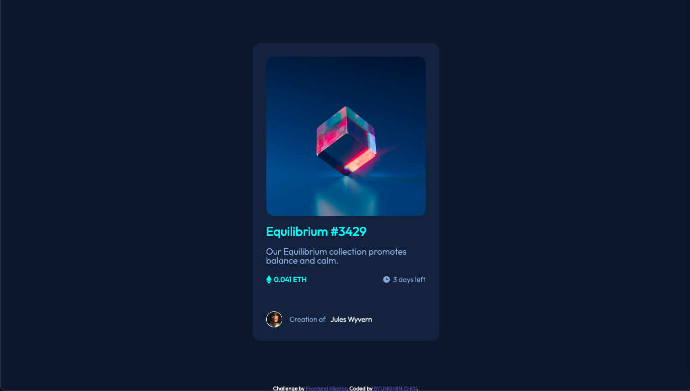
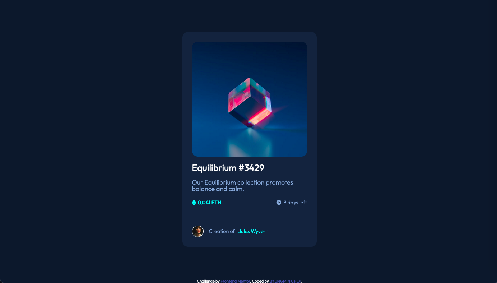

# Frontend Mentor - NFT preview card component solution

This is a solution to the [NFT preview card component challenge on Frontend Mentor](https://www.frontendmentor.io/challenges/nft-preview-card-component-SbdUL_w0U). Frontend Mentor challenges help you improve your coding skills by building realistic projects.

## Table of contents

- [Overview](#overview)
  - [The challenge](#the-challenge)
  - [Screenshot](#screenshot)
  - [Links](#links)
- [My process](#my-process)
  - [Built with](#built-with)
  - [Useful resources](#useful-resources)
- [Author](#author)

## Overview

### The challenge

Users should be able to:

- View the optimal layout depending on their device's screen size
- See hover states for interactive elements

### Screenshot

- #### Desktop Fullscreen

  

- #### Desktop Vertical Halfscreen Top

  

- #### Desktop Vertical Halfscreen Bottom

  

- #### Mobile Fullscreen

  

- #### Mobile Vertical Halfscreen Top

  

- #### Mobile Vertical Halfscreen Bottom

  

- #### Image Hover

  

- #### Description Hover

  

- #### User Name Hover

  

### Links

- [Solution URL](https://github.com/PhilosopherProgrammer/NFTPreviewCardComponent)
- [Live Site URL](https://philosopherprogrammer.github.io/NFTPreviewCardComponent/)

## My process

### Built with

- Semantic HTML5 markup
- CSS custom properties
- Flexbox

### Useful resources

- [Image Hover](https://www.w3schools.com/howto/tryit.asp?filename=tryhow_css_image_overlay_opacity)
- [Flex justify content - space between](https://developer.mozilla.org/en-US/docs/Web/CSS/justify-content)

### Author

- Website - [BYUNGMIN CHOI](byungmin-choi.com)
- Frontend Mentor - [@PhilosopherProgrammer](https://www.frontendmentor.io/profile/PhilosopherProgrammer)
